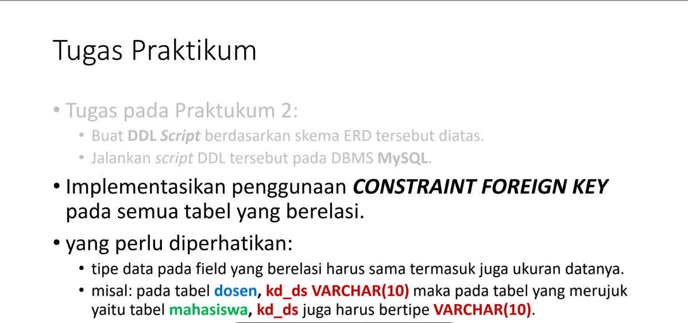

# Praktikum_3
Implementasi penggunaan CONSTRAINT FOREIGN KEY

## Profil
| Variable | Isi |
| -------- | --- |
| **Nama** | Gilar Sumilar |
| **NIM** | 312210407 |
| **Kelas** | TI.22.A4 |
| **Mata Kuliah** | Basis data |
| **Link PDF** | [Klik untuk melihat](https://github.com/GilarSumilar/Praktikum_3/blob/main/Laporan%20Praktikum_3.pdf) |

## Tugas praktikum

#### Pada tugas praktikum 2 sudah ada di tugas sebelum nya 
### Soal praktikum
[Link pengerjaan soal](https://github.com/GilarSumilar/Praktikum_3/blob/main/Laporan%20Praktikum_3.pdf)
- Note : Script DLL sudah terdapat di PDF.

### Evaluasi pertanyaan
#### - Tulis semua perintah-perintah SQL percobaan di atas beserta outputnya!
  [Link PDF](https://github.com/GilarSumilar/Praktikum_3/blob/main/Laporan%20Praktikum_3.pdf)
#### - Apa bedanya penggunaan RESTRICT dan penggunaan CASCADE

RESTRICT berarti jika kita ingin menghapus atau memperbarui data di tabel utama, MySQL akan memeriksa apakah ada data di tabel terkait yang masih menggunakan data tersebut. Jika masih ada, MySQL akan menghentikan tindakan hapus atau perbarui dan memberikan pesan kesalahan.

Sedangkan CASCADE berarti jika kita menghapus atau memperbarui data di tabel utama, MySQL akan menghapus atau memperbarui data di tabel terkait secara otomatis tanpa kita harus melakukan tindakan secara manual.

Kita harus berhati-hati dalam menggunakan opsi CASCADE karena bisa jadi data yang tidak seharusnya terhapus atau diperbarui ikut terkena dampaknya. Sebaiknya, gunakan opsi RESTRICT jika masih ragu atau tidak yakin dengan dampak yang mungkin terjadi.
       
#### - Berikan kesimpulan anda!
RESTRICT dan CASCADE adalah dua opsi yang tersedia di MySQL ketika kita ingin menghapus atau memperbarui data di tabel utama yang memiliki referensi asing ke tabel lain.

RESTRICT akan membatalkan tindakan hapus atau perbarui jika ada data di tabel terkait yang masih menggunakan data tersebut, sementara CASCADE akan menghapus atau memperbarui data di tabel terkait secara otomatis.

#### - Buat laporan praktikum yang berisi, langkah-langkah praktikum
[Link PDF](https://github.com/GilarSumilar/Praktikum_3/blob/main/Laporan%20Praktikum_3.pdf)
